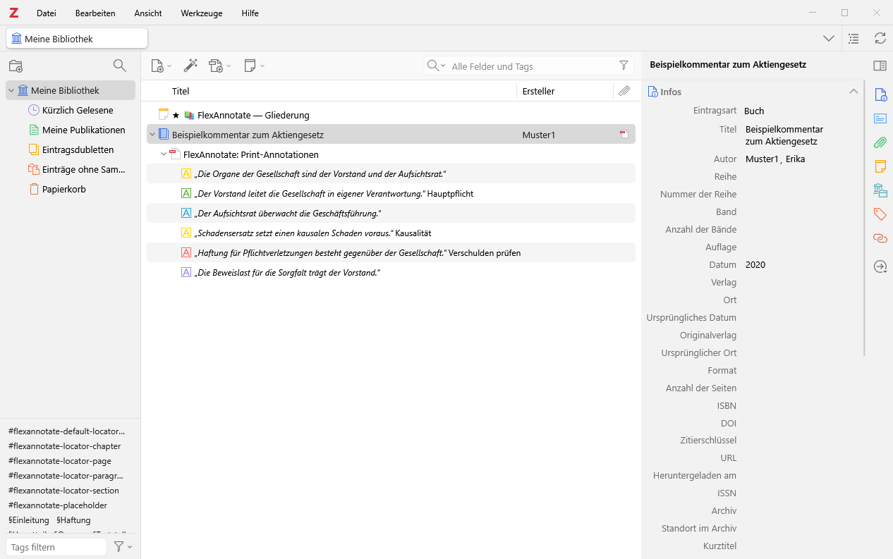
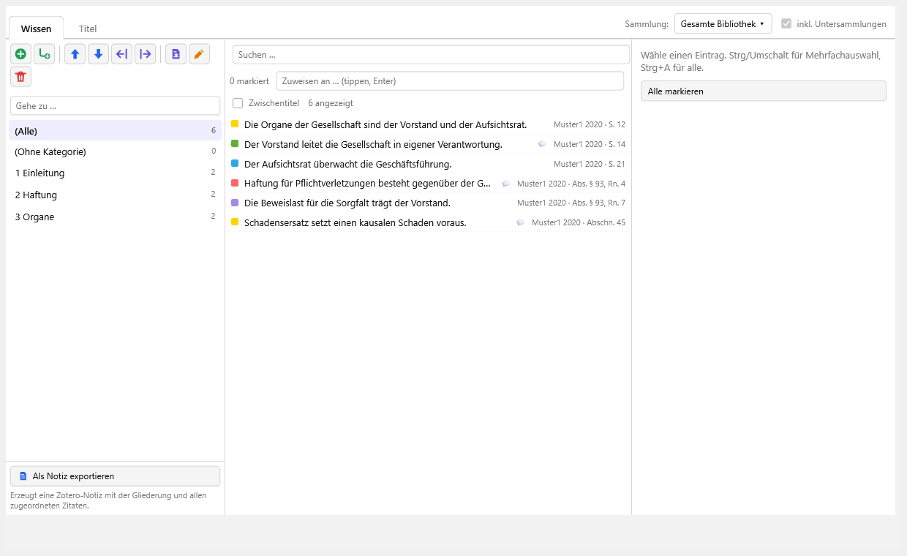
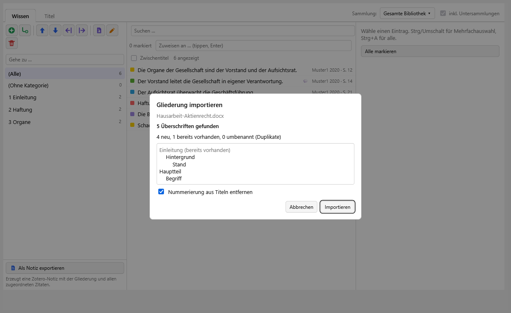
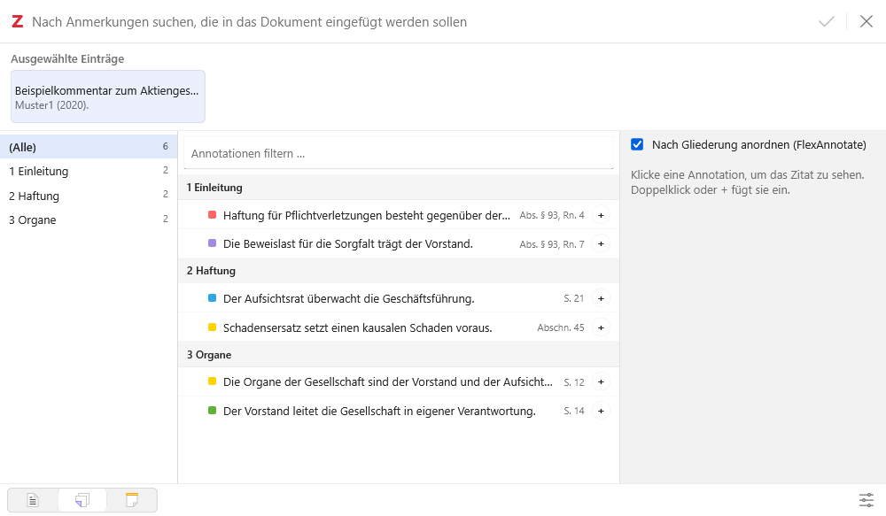
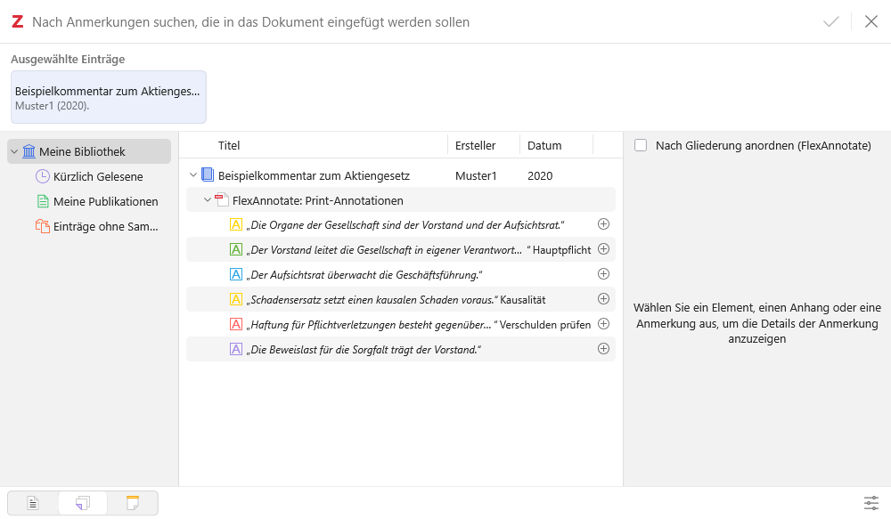
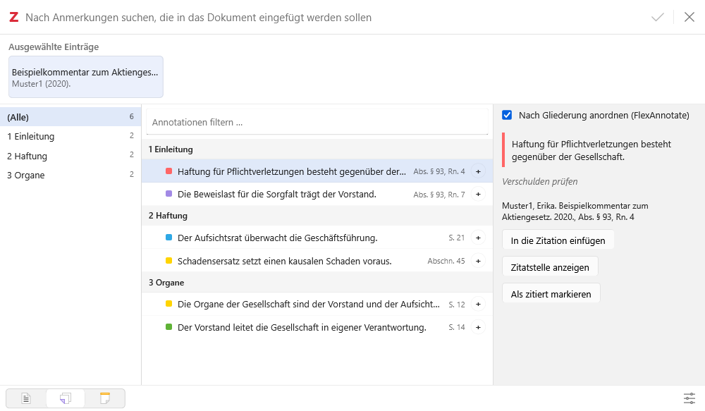
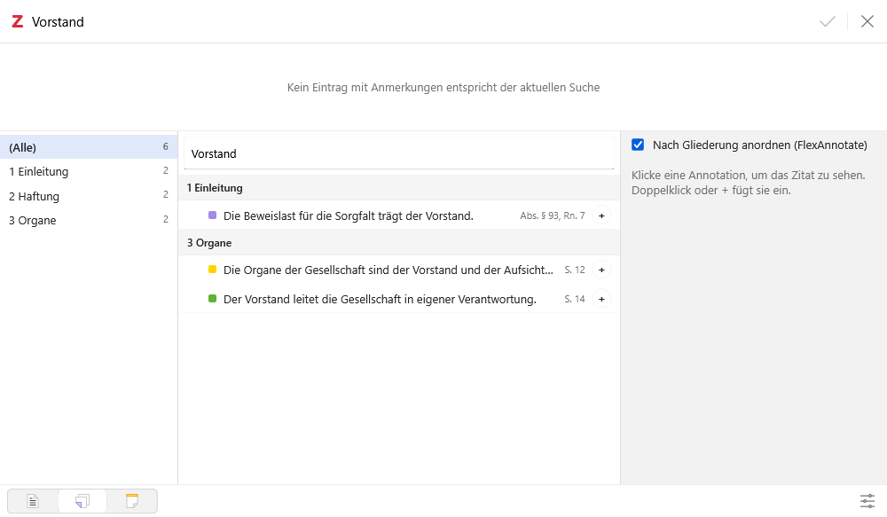
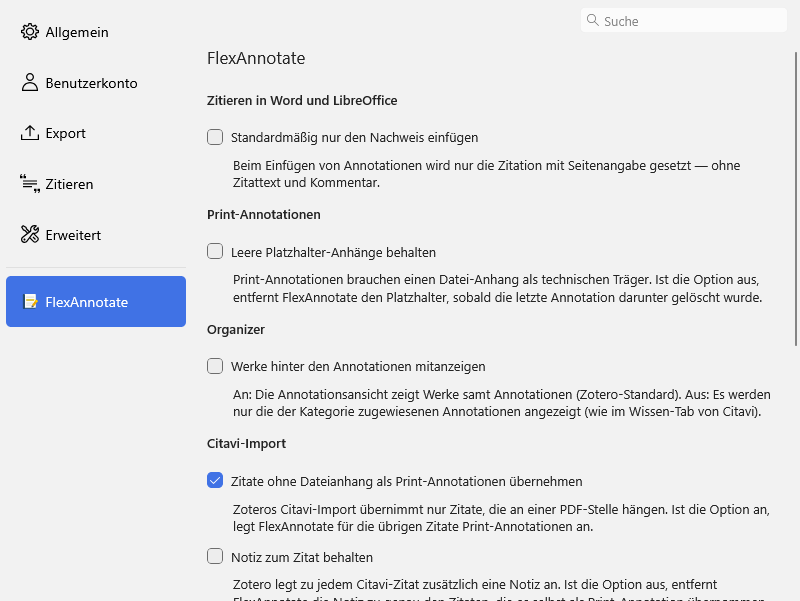

# FlexAnnotate

**Sprache / Language: [Deutsch](#deutsch) · [English](#english)**

Zotero-Plugin für gedruckte Quellen: Annotationen ohne Datei, Nur-Nachweis-Zitieren, Citavi-Import und ein Organizer (Gliederung) für Annotationen. Version 2.0.0-dev.0, Zotero 7.0 bis 10 (geprüft gegen 7.0.32, 8.0.4, 9.0.6 und 10.0.5/10.0.6; Umfang je Version siehe [Einschränkungen](#einschränkungen-auf-zotero-versionen-vor-10)).

## Deutsch

### Inhalt

[Wozu](#wozu) · [Funktionen](#funktionen) · [Installation](#installation) · [Bedienung](#bedienung) · [Einstellungen](#einstellungen) · [Einschränkungen vor Zotero 10](#einschränkungen-auf-zotero-versionen-vor-10) · [Daten und Kompatibilität](#daten-und-kompatibilität) · [Bekannte Punkte](#bekannte-punkte) · [Entwicklung](#entwicklung) · [Lizenz und Herkunft](#lizenz-und-herkunft)

### Wozu

Zotero legt Annotationen nur unter einem Dateianhang (PDF, EPUB, Snapshot) ab. Wer mit gedruckten Büchern, Kommentaren oder Gesetzessammlungen arbeitet, hat dort keine Datei und kann Textstellen samt Seitenangabe nicht als Annotation festhalten. Außerdem setzt Zotero Annotationen in Word und LibreOffice immer mit Zitattext ein, und Zoteros Citavi-Import verwirft Zitate ohne PDF-Anker.

FlexAnnotate füllt diese Lücken und bringt einen Organizer mit, der Annotationen in einer Gliederung ordnet (Wissensorganisation wie in Citavi). Seit 2.0.0 sind das frühere FlexAnnotate und Annotree ein einziges Plugin.

### Funktionen

#### Gedruckte Quellen

- **Print-Annotationen:** Annotationen mit eigener Seitenangabe und wählbarem Locator (Seite, Randnummer, Absatz …) für Titel ohne Dateianhang. Technisch hängen sie an einem automatisch angelegten Platzhalter-Anhang. Das Plugin-Icon zeigt ein Buch mit Textmarker. Bearbeiten und Löschen per Kontextmenü; Locator und Kommentar lassen sich auch an PDF-/EPUB-Annotationen im Reader ändern.
- **Nur-Nachweis-Zitieren:** Beim Einfügen von Annotationen aus Word oder LibreOffice wahlweise nur die Zitation mit Fundstelle, ohne Zitattext. Umschaltbar im Zitierdialog („Einfügen als“) und in den Einstellungen.
- **Citavi-Import:** Zitate ohne Dateianhang, die Zoteros Importer verwirft, werden als Print-Annotationen angelegt; Schlagwörter werden exakt zugeordnet. Ein zweiter Import desselben Exports legt nichts neu an: gleich sind Platzhalter (Werk), Seitenlabel und normalisierter Zitattext, bei leerem Text Seitenlabel und Kommentar. Beiträge werden mit ihrem Hauptwerk verknüpft.



#### Organizer

- **Gliederung:** Überschriften (beliebig verschachtelt, Dezimalnummern nur zur Anzeige) ordnen Annotationen und Werke per Drag and Drop oder Zuweisungsleiste. Tabs „Wissen“ (Annotationen) und „Titel“ (Werke), Auswahl der Sammlung, Bearbeiten von Zitattext, Kommentar, Zitatstelle und Locator, Tastaturbedienung. Der Organizer öffnet sich über den Toolbar-Button (zweites Symbol von rechts, vor dem Sync-Button).
- **Export:** „Als Notiz exportieren“ legt eine Zotero-Notiz mit der Gliederung und den zugeordneten Zitaten an. „Zitatstelle öffnen“ springt zur Annotation im Reader.




- **Gliederungsimport aus Word/LibreOffice:** übernimmt die Überschriften eines `.docx`- oder `.odt`-Dokuments in die Gliederung (siehe unten).



#### Zitierdialog aus Word und LibreOffice

Im Annotationsbereich des Zitierdialogs (ab Zotero 9) ergänzt FlexAnnotate die Option „Nach Gliederung anordnen (FlexAnnotate)“. Sie zeigt drei Spalten: Überschriften mit Anzahl, Annotationen, Vorschau. Ein grüner Haken markiert bereits zitierte Annotationen.

- Die rechte Spalte hat mit und ohne Gliederungsansicht dieselbe, native Breite.
- Die Suchleiste oben im Dialog filtert die Gliederungsliste mit. Der Text wird ins Filterfeld des Plugins gespiegelt, nicht umgekehrt.
- Bei genau einer markierten Annotation öffnet „Zitatstelle anzeigen“ den Reader an der Annotation und holt Zotero nach vorn. Der Dialog bleibt offen.









### Installation

Fertiges XPI: [Releases](https://github.com/justanotherjurastudent/zotero_flexAnnotations/releases) (2.0.0 ist noch nicht veröffentlicht). In Zotero: _Werkzeuge → Plugins → Zahnrad → Plugin aus Datei installieren…_.

Selbst bauen (Node.js 24 wurde verwendet):

```bash
npm install
npm run build     # -> .scaffold/build/flex-annotate.xpi
```

Mindestversion ist Zotero 7.0 (Manifest). Was vor Zotero 10 fehlt, steht im Abschnitt [Einschränkungen](#einschränkungen-auf-zotero-versionen-vor-10).

### Bedienung

| Wo                                                | Was                                                                                |
| ------------------------------------------------- | ---------------------------------------------------------------------------------- |
| Rechtsklick auf einen Titel                       | _Print-Annotation hinzufügen…_                                                     |
| Rechtsklick auf eine Annotation (Item-Baum)       | _Annotation bearbeiten…_, bei Print-Annotationen auch _Print-Annotation löschen_   |
| Rechtsklick auf eine Annotation (rechter Bereich) | dieselben Einträge                                                                 |
| Reader: Rechtsklick auf eine Annotation           | _Kommentar hinzufügen…/bearbeiten…_, _Locator festlegen…_                          |
| Reader: Seitenzahl bearbeiten                     | Locator-Auswahl und „Diesen Locator künftig für dieses Dokument verwenden“         |
| Toolbar-Button oben rechts, neben dem Sync-Button | öffnet den Organizer                                                               |
| _Werkzeuge → FlexAnnotate: Organizer_             | öffnet den Organizer                                                               |
| Organizer, Dokument-Symbol der Gliederungsleiste  | Gliederung aus Word/LibreOffice importieren                                        |
| Zitierdialog aus Word/LibreOffice                 | „Einfügen als“ (Vollnachweis / Nur Nachweis); im Annotationsbereich die Gliederung |
| _Bearbeiten → Einstellungen → FlexAnnotate_       | Einstellungen                                                                      |

#### Gliederung aus Word/LibreOffice importieren

1. Organizer öffnen und in der Gliederungsleiste das Dokument-Symbol anklicken (_Gliederung aus Word/ODT-Dokument importieren…_).
2. Ein `.docx`- oder `.odt`-Dokument wählen.
3. In der Vorschau die Zähler (neu, vorhanden, umbenannt) und die eingerückte Liste prüfen. Die Option „Nummerierung aus Titeln entfernen“ erscheint nur, wenn eine manuelle Nummerierung erkannt wurde (Formen wie `1.`, `1.2`, `1)`, `A.`, `I.`, `a)`, `(1)` in mindestens 80 % und mindestens 3 Überschriften).
4. _Importieren_ klicken; mit _Abbrechen_ bleibt alles unverändert.
5. Die neuen Überschriften stehen in der Gliederung; Annotationen werden wie gewohnt zugeordnet.

Erkannt werden die Formatvorlagen „Überschrift 1/2/3 …“ bzw. „Heading 1/2/3 …“, benutzerdefinierte Vorlagen mit Gliederungsebene (`outlineLvl`) und in ODT `text:h`. Die Ebenen werden lückenlos gemacht (die erste Überschrift ist Ebene 1, keine Ebene springt um mehr als eins).

Der Import hängt nur an: Nichts wird gelöscht oder verschoben. Eine Überschrift mit gleichem Titel (ohne Beachtung von Groß-/Kleinschreibung und Leerraum) unter demselben Elternknoten wird wiederverwendet, sonst entsteht sie als letztes Kind. Weil jede Überschrift ein Tag ist, müssen Titel eindeutig sein; Duplikate heißen „Titel (2)“, „Titel (3)“.

Grenzen:

- Nur Absatz-Formatvorlagen und `outlineLvl`; fett gesetzter Fließtext zählt nicht als Überschrift.
- Fußnoten und gelöschte Änderungen fließen nicht in den Titel ein.
- `.doc` und `.rtf` werden nicht unterstützt (vorher in `.docx` oder `.odt` speichern).
- Je XML-Eintrag (`document.xml`, `styles.xml`, `content.xml`) gilt eine Grenze von 50 MB.
- Textfelder sowie Kopf- und Fußzeilen werden nicht gezielt behandelt.

### Einstellungen

Schlüssel liegen unter `extensions.flexannotate.`.



| Option                                                                       | Wirkung                                                                  | Standard                                                                               |
| ---------------------------------------------------------------------------- | ------------------------------------------------------------------------ | -------------------------------------------------------------------------------------- |
| Standardmäßig nur den Nachweis einfügen (`citationOnly`)                     | Annotationen werden nur als Zitation mit Seitenangabe eingefügt          | aus                                                                                    |
| Leere Platzhalter-Anhänge behalten (`keepEmptyPlaceholders`)                 | Platzhalter bleibt, auch wenn keine Annotation mehr daran hängt          | aus                                                                                    |
| Werke hinter den Annotationen mitanzeigen (`showWorksInAnnotationView`)      | Organizer: Annotationsansicht zeigt auch die Werke                       | aus                                                                                    |
| Zitate ohne Dateianhang als Print-Annotationen übernehmen (`citaviImport`)   | Citavi-Import legt Print-Annotationen für Zitate an, die Zotero verwirft | an                                                                                     |
| Notiz zum Zitat behalten (`citaviKeepNotes`)                                 | Aus: die Notiz, die Zoteros Übersetzer zum Zitat anlegt, wird entfernt   | aus                                                                                    |
| Beiträge mit ihrem Hauptwerk verknüpfen (`citaviLinkContributions`)          | Citavi-Import legt „Verwandte“-Verknüpfungen an                          | an                                                                                     |
| Fundstellen zitieren als (`citaviLocatorPage/Column/Paragraph/Margin/Other`) | CSL-Locator je Citavi-Seitentyp                                          | Seite: page, Spalte: column, Paragraph: paragraph, Randnummer: paragraph, Andere: page |

Intern, ohne Oberfläche: `dialogOutlineView` (Zustand der Gliederungsoption im Zitierdialog), `citedAnnotations` (zitierte Annotationen je Dokument).

### Einschränkungen auf Zotero-Versionen vor 10

Das Manifest verlangt Zotero 7.0 bis 10.\*. Geprüft ist das nur durch die automatische Zotero-Testsuite (`npm run test:versions`, siehe [docs/testing.md](docs/testing.md)) gegen Zotero **7.0.32, 8.0.4, 9.0.6** und **10.0.5/10.0.6**. Andere Patchversionen derselben Reihen sind nicht geprüft; Abweichungen dort sind nicht ausgeschlossen.

| Funktion                                                                                            | 7.0.x                       | 8.0.x                       | 9.0.x                       | 10.x                    |
| --------------------------------------------------------------------------------------------------- | --------------------------- | --------------------------- | --------------------------- | ----------------------- |
| Organizer (Fenster, Gliederung, Export), Toolbar-Button                                             | geprüft                     | geprüft                     | geprüft                     | geprüft                 |
| Gliederungsimport aus Word/LibreOffice                                                              | geprüft                     | geprüft                     | geprüft                     | geprüft                 |
| Print-Annotationen inkl. Eingabemaske                                                               | geprüft, Farbmenü: Rückfall | geprüft, Farbmenü: Rückfall | geprüft, Farbmenü: Rückfall | geprüft                 |
| Citavi-Import                                                                                       | geprüft                     | geprüft                     | geprüft                     | geprüft                 |
| Nur-Nachweis-Zitieren (Patch von `_insertCitingResult`, nur synthetisch geprüft)                    | geprüft                     | geprüft                     | geprüft                     | geprüft                 |
| Menü _Werkzeuge → FlexAnnotate: Organizer_                                                          | Rückfall (DOM)              | geprüft (`MenuManager`)     | geprüft (`MenuManager`)     | geprüft (`MenuManager`) |
| Zitierdialog mit Annotationsmodus: Modus-Auswahl, Gliederungsansicht, Suche, „Zitatstelle anzeigen“ | nicht verfügbar             | nicht verfügbar             | geprüft                     | geprüft                 |
| Einstellungsfenster                                                                                 | geprüft                     | geprüft                     | geprüft                     | geprüft                 |

- **Farbmenü (7.x bis 9.x):** `Zotero.Annotations.COLORS` gibt es erst ab 10.x. Davor verwendet die Eingabemaske die acht Standardfarben von Zotero (`STANDARD_COLORS` in `src/core/printAnnotation.ts`).
- **Werkzeugmenü (7.x):** `Zotero.MenuManager` fehlt in 7.0.32; der Eintrag wird direkt in das Menü _Werkzeuge_ eingehängt. Die übrigen Menüs (Rechtsklick auf Titel und Annotationen) arbeiten ohnehin über DOM.
- **Zitierdialog (7.x, 8.x):** Der Annotationsmodus im Zitierdialog existiert erst ab Zotero 9. Auf 7.x und 8.x gibt es dort weder die Option „Nach Gliederung anordnen“ noch die Modus-Auswahl „Einfügen als“ noch „Zitatstelle anzeigen“. Das Plugin tut in diesem Dialog nichts und stört nicht.

### Daten und Kompatibilität

Nutzerdaten der Version 1.x gelten unverändert weiter; die Preference-Schlüssel `extensions.flexannotate.*` sind gleich geblieben.

- `#flexannotate-locator-<typ>`: Locator-Typ einer Annotation (automatischer Tag; bei „Seite“ ohne abweichenden Dokument-Standard kein Tag).
- `#flexannotate-default-locator-<typ>`: Standard-Locator eines Anhangs für künftige Annotationen.
- `#flexannotate-placeholder`: kennzeichnet den Platzhalter-Anhang der Print-Annotationen.
- `§Titel`: Überschrift der Gliederung als Tag an zugeordneten Annotationen und Werken (Lattice-kompatibel).
- `★outline` und `LATTICE-OUTLINE-V1`: Notiz mit dem Gliederungsbaum als JSON (Lattice-kompatibel).

Die alte Version 1.2.0 ist über den Git-Tag `pre-merge` erreichbar.

### Bekannte Punkte

- Die Gliederungsnotiz `★outline` nicht selbst im Notiz-Editor öffnen und dort bearbeiten: Der Editor kann sie später mit seinem Stand überschreiben (Hintergrund: [docs/architecture.md](docs/architecture.md), Fallstrick 14). FlexAnnotate legt sie so an, dass Zotero sie nicht von sich aus öffnet.
- Das Seitenformat `PageRange` (`<os>`/`<nt>`) ist nur gegen synthetische Fixtures getestet.
- Reader-Popup, Reader-Menü sowie Toolbar- und Menü-Icons im Dark Mode sind nur per Code-Review geprüft, nicht visuell und nicht automatisch.
- Das Toolbar-Icon ist 16 px groß; Zoteros eigene Icons sind 20 px.
- Bearbeiten und Löschen für Annotationen im Item-Baum laufen über DOM, nicht über `MenuManager`: Zotero wendet bei Annotationsauswahl keine Plugin-Menüs an (`zoteroPane.js:4680` in 10.0.5).
- Nicht automatisch getestet: Reader-Fenster, ein echter Word-Lauf, der echte Citavi-Translator (siehe [docs/testing.md](docs/testing.md)).

### Entwicklung

Befehle, Aufbau und Regeln: [AGENTS.md](AGENTS.md). Dazu [docs/architecture.md](docs/architecture.md) (Aufbau, Datenmodell, Fallstricke), [docs/testing.md](docs/testing.md), [docs/anchors.md](docs/anchors.md) (verwendete Zotero-Interna) und [CHANGELOG.md](CHANGELOG.md).

### Lizenz und Herkunft

[AGPL-3.0-or-later](LICENSE). Der Organizer basiert auf [Lattice](https://github.com/birugit/zotero-grounded-qa) von birugit (AGPL-3.0-or-later); die Print-Annotationen, das Nur-Nachweis-Zitieren und der Citavi-Import stammen vom Projektautor. Einzelheiten: [NOTICE.md](NOTICE.md).

---

## English

### Contents

[Purpose](#purpose) · [Features](#features) · [Install](#install) · [Where to find things](#where-to-find-things) · [Settings and data](#settings-and-data) · [Zotero versions before 10](#zotero-versions-before-10) · [Known issues](#known-issues) · [Development and license](#development-and-license)

### Purpose

Zotero stores annotations only under a file attachment, so printed books, commentaries and statute collections cannot hold annotations with a page reference. Zotero also always inserts annotations into Word and LibreOffice with their quoted text, and its Citavi import discards quotes without a PDF anchor. FlexAnnotate closes these gaps and adds an organizer that files annotations under an outline. Since 2.0.0, the former FlexAnnotate and Annotree are one plugin.

### Features

**Printed sources**

- Print annotations: annotations with a manual page reference and selectable locator on items without a file. They hang under an automatically created placeholder attachment.
- Citation-only insertion: insert only the citation with its pinpoint from Word or LibreOffice (toggle in the citation dialog and in the settings).
- Citavi import: quotes without a file attachment become print annotations; keywords are matched exactly; importing the same export again creates nothing new; contributions are linked to their parent work.

**Organizer**

- Outline: headings (tags `§Title`) file annotations and works by drag and drop; export as a Zotero note.
- Outline import: the toolbar button with the document icon reads the heading styles of a `.docx` or `.odt` file, shows a preview and appends the headings to the outline (nothing is deleted or moved; duplicates become "Title (2)"). `.doc` and `.rtf` are not supported.
- Citation dialog view (Zotero 9 and later): option "Nach Gliederung anordnen (FlexAnnotate)" in the annotations view of the dialog opened from Word, with a green check for already cited annotations. The right column keeps its native width, the dialog's search bar also filters the outline list, and "Zitatstelle anzeigen" opens the reader at the annotation.

### Install

Download the XPI from [Releases](https://github.com/justanotherjurastudent/zotero_flexAnnotations/releases) (2.0.0 is not released yet) or build it with `npm install && npm run build` (`.scaffold/build/flex-annotate.xpi`). Install it via _Tools → Plugins → gear → Install Plugin From File…_.

### Where to find things

- Right-click an item: _Add print annotation…_; right-click an annotation: _Edit annotation…_ (print annotations also _Delete_).
- Organizer: toolbar button next to the Sync button, or _Tools → FlexAnnotate: Organizer_.
- Settings: _Edit → Settings → FlexAnnotate_ (preference keys `extensions.flexannotate.*`).

### Settings and data

The settings table above applies (German UI labels; the English UI uses the same options). Data created by 1.x keeps working unchanged: tags `#flexannotate-locator-<type>`, `#flexannotate-default-locator-<type>`, `#flexannotate-placeholder`, and the Lattice-compatible `§Title` tags and `★outline` note (`LATTICE-OUTLINE-V1`). Version 1.2.0 is available at the Git tag `pre-merge`.

### Zotero versions before 10

The manifest allows Zotero 7.0 to 10.\*. Only these versions were run through the automated suite: 7.0.32, 8.0.4, 9.0.6 and 10.0.5/10.0.6; other patch releases are untested. On all four, the organizer (with toolbar button), outline import, print annotations, Citavi import, the citation-only patch and the settings pane pass the tests. Differences:

- **Before 10:** the color menu of the print annotation panel falls back to Zotero's eight standard colors (`Zotero.Annotations.COLORS` exists only in 10.x).
- **7.x:** no `Zotero.MenuManager`; _Tools → FlexAnnotate: Organizer_ is added to the Tools menu directly.
- **7.x and 8.x:** the citation dialog has no annotations mode (it starts in 9.x). The mode selector, the outline view, the search mirror and "Zitatstelle anzeigen" are therefore not available there; the plugin does nothing in that dialog.

The full matrix is in the German section above.

### Known issues

See the German list above. In short: do not edit the `★outline` note in Zotero's note editor, the `PageRange` format is only tested against synthetic fixtures, and dark-mode icons and the reader popup were reviewed in code only.

### Development and license

See [AGENTS.md](AGENTS.md) and [docs/](docs/). AGPL-3.0-or-later; the organizer is based on Lattice by birugit, see [NOTICE.md](NOTICE.md).
